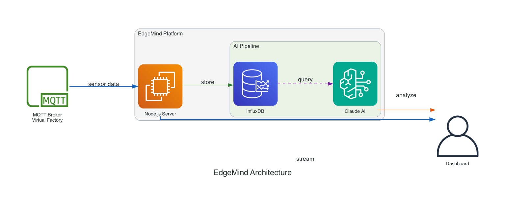

# EdgeMind - Factory Intelligence Dashboard

**INTERNAL USE ONLY - COMPANY PROPRIETARY**

Real-time factory intelligence dashboard for the ProveIt! Conference 2026. Connects to a virtual factory MQTT broker, stores time-series data in InfluxDB, and uses Claude AI (via AWS Bedrock) to analyze trends and detect anomalies.

## Architecture



```
MQTT Broker (virtualfactory.proveit.services:1883)
    |
    v (subscribes to '#')
Node.js Server (server.js)
    |-- Writes all numeric data to InfluxDB
    |-- Throttled WebSocket broadcast (every 10th message)
    +-- Agentic Loop (every 30 seconds):
            |
            v
        Queries InfluxDB (5-minute rolling window)
            |
            v
        Claude analyzes trends (via AWS Bedrock)
            |
            v
        Broadcasts insights via WebSocket
            |
            v
Frontend (index.html) <-- WebSocket (port 3000/ws)
```

## Quick Start

### Prerequisites

- Node.js 18+
- Docker and Docker Compose
- AWS credentials configured (`~/.aws/credentials` or IAM role)

### 1. Clone and Configure

```bash
git clone <repository-url>
cd EdgeMind

# Copy environment template and configure
cp .env.template .env
```

Edit `.env` with your credentials:
```bash
AWS_REGION=us-east-1
BEDROCK_MODEL_ID=us.anthropic.claude-sonnet-4-20250514-v1:0
MQTT_PASSWORD=<your-mqtt-password>
```

### 2. Start with Docker Compose

```bash
docker compose up -d
```

This starts:
- InfluxDB on port 8086
- EdgeMind backend on port 3000

### 3. Verify

```bash
# Check health endpoint
curl http://localhost:3000/health

# Expected response:
# {"status":"online","mqtt":true,"influxdb":true,"stats":{...}}
```

Open http://localhost:3000 in your browser to see the dashboard.

## Local Development

```bash
# Install dependencies
npm install

# Start InfluxDB (if not using Docker Compose)
docker run -d --name influxdb -p 8086:8086 \
  -e DOCKER_INFLUXDB_INIT_MODE=setup \
  -e DOCKER_INFLUXDB_INIT_USERNAME=admin \
  -e DOCKER_INFLUXDB_INIT_PASSWORD=proveit2026 \
  -e DOCKER_INFLUXDB_INIT_ORG=proveit \
  -e DOCKER_INFLUXDB_INIT_BUCKET=factory \
  -e DOCKER_INFLUXDB_INIT_ADMIN_TOKEN=proveit-factory-token-2026 \
  influxdb:2.7

# Start server with hot reload
npm run dev
```

## API Endpoints

| Endpoint | Description |
|----------|-------------|
| `GET /health` | Server health check with MQTT and InfluxDB status |
| `GET /api/trends` | 5-minute rolling window of factory metrics |
| `GET /api/oee/v2?enterprise={name}` | Enhanced OEE calculation with tier-based strategy |
| `GET /api/oee/discovery` | Discovered OEE schema for all enterprises |
| `GET /api/schema/measurements` | All measurements with metadata (cached 5 min) |
| `GET /api/schema/hierarchy` | Topic hierarchy: Enterprise > Site > Area > Machine |
| `GET /api/factory/status` | Hierarchical OEE status by enterprise and site |

See [CLAUDE.md](CLAUDE.md) for complete API documentation and WebSocket message types.

## Environment Variables

| Variable | Required | Default | Description |
|----------|----------|---------|-------------|
| `AWS_REGION` | Yes | `us-east-1` | AWS region for Bedrock |
| `BEDROCK_MODEL_ID` | No | `us.anthropic.claude-sonnet-4-20250514-v1:0` | Claude model ID |
| `PORT` | No | `3000` | HTTP server port |
| `MQTT_HOST` | No | `mqtt://virtualfactory.proveit.services:1883` | MQTT broker URL |
| `MQTT_USERNAME` | No | `proveitreadonly` | MQTT username |
| `MQTT_PASSWORD` | Yes | - | MQTT password |
| `INFLUXDB_URL` | No | `http://localhost:8086` | InfluxDB URL |
| `INFLUXDB_TOKEN` | No | `proveit-factory-token-2026` | InfluxDB auth token |
| `INFLUXDB_ORG` | No | `proveit` | InfluxDB organization |
| `INFLUXDB_BUCKET` | No | `factory` | InfluxDB bucket |
| `DISABLE_INSIGHTS` | No | `false` | Set to `true` to disable AI analysis |

## Project Structure

```
EdgeMind/
├── server.js                  # Backend: MQTT, InfluxDB, WebSocket, Claude
├── index.html                 # Live dashboard (production)
├── factory-live.html          # Live dashboard (development)
├── factory-command-center.html # Static mockup (no backend)
├── docker-compose.yml         # Docker Compose configuration
├── Dockerfile                 # Container build configuration
├── .env.template              # Environment variable template
├── CLAUDE.md                  # AI-assisted development guide
├── CONTRIBUTING.md            # Contribution guidelines
└── docs/
    └── edgemind_architecture_python.png  # Architecture diagram
```

## Contributing

See [CONTRIBUTING.md](CONTRIBUTING.md) for internal contribution guidelines.

## AI-Assisted Development

This project uses [CLAUDE.md](CLAUDE.md) to provide context for AI-assisted development with Claude Code. The file contains:
- Detailed architecture documentation
- API endpoint specifications
- MQTT topic structure
- InfluxDB schema
- WebSocket message types

---

**INTERNAL USE ONLY** - This repository contains proprietary code and configurations for the ProveIt! Conference 2026 demonstration.

## Development Tools

- [Topic Classifier Debugging Guide](docs/TOPIC_CLASSIFIER_DEBUG.md) - How to identify and fix unclassified MQTT topics
