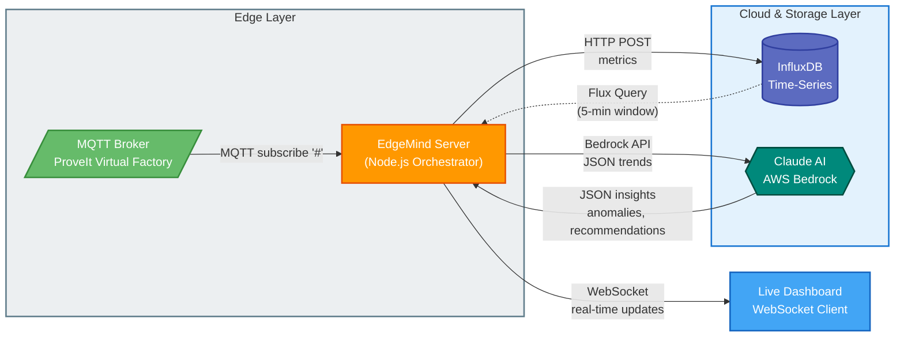

# EdgeMind Executive Overview

A real-time factory intelligence dashboard that connects to a virtual manufacturing facility, stores time-series data, and uses **Claude on AWS Bedrock** to automatically detect trends and anomalies.

---

## Architecture



### Data Flow

| Step | Component | Action |
|------|-----------|--------|
| 1 | **MQTT Broker** | Publishes sensor data from manufacturing equipment |
| 2 | **EdgeMind Server** | Subscribes to ALL topics (`#`), writes to InfluxDB |
| 3 | **Agentic Loop** | Every 30s: Query InfluxDB → Summarize → Send to Claude |
| 4 | **Claude AI** | Analyzes trends, returns structured insights |
| 5 | **Dashboard** | Receives real-time data + AI insights via WebSocket |

---

## How Claude Gets Prompted

**Every 30 seconds**, the server runs this workflow:

### Step 1: Query InfluxDB for Pre-Aggregated Trends

```flux
from(bucket: "factory")
  |> range(start: -5m)
  |> aggregateWindow(every: 1m, fn: mean)
```

Claude **never sees raw MQTT messages**. It only sees summarized trend data:

```
Enterprise A/Dallas Line 1/packaging/metric_oee: avg=85.2, change=+2.3% (5 points)
Enterprise B/Site3/palletizing/metric_temp: avg=72.1, change=-1.2% (5 points)
```

### Step 2: The Prompt Sent to Claude

```
You are an AI factory monitoring agent analyzing time-series trend data
from a manufacturing facility.

## Current Trend Data (Last 5 Minutes, 1-Minute Aggregates)
{summarized trend data}

## Your Task
Analyze these trends and provide:
1. Summary: A 1-2 sentence overview of factory performance
2. Trends: Key metrics that are rising, falling, or stable
3. Anomalies: Any concerning patterns
4. Recommendations: Actionable suggestions for operators

Respond in JSON format:
{
  "summary": "...",
  "trends": [...],
  "anomalies": [...],
  "recommendations": [...],
  "severity": "low|medium|high",
  "confidence": 0.0-1.0
}
```

### Step 3: Broadcast to Dashboards

The JSON response is parsed and pushed to all connected dashboards via WebSocket in real-time.

---

## AWS Services Used

| Service | Usage | Configuration |
|---------|-------|---------------|
| **AWS Bedrock** | Claude inference for trend analysis | `us.anthropic.claude-sonnet-4-20250514-v1:0` |
| **Region** | Primary deployment | `us-east-1` (configurable) |

---

## Key Design Decisions

### 1. Trend-Based Analysis (Not Raw Data)
Claude analyzes aggregated 1-minute windows, not individual sensor readings. This reduces noise, improves insight quality, and minimizes API costs.

### 2. 30-Second Analysis Cycle
Frequent enough for a real-time feel, sparse enough to optimize Bedrock usage costs.

### 3. Structured JSON Output
Claude is prompted to return structured data so the frontend can consistently render trends, anomalies, and recommendations.

### 4. Interactive Q&A
Users can ask Claude questions directly through the dashboard. Questions include recent trend insights as context for more relevant answers.

---

## Technical Stack

| Component | Technology |
|-----------|------------|
| Backend | Node.js + Express |
| Message Broker | MQTT (Mosquitto-compatible) |
| Time-Series DB | InfluxDB 2.7 |
| AI/ML | AWS Bedrock (Claude Sonnet) |
| Real-Time | WebSocket |
| Frontend | HTML/JavaScript |

---

## API Endpoints

| Endpoint | Description |
|----------|-------------|
| `GET /health` | Server health check with MQTT/InfluxDB status |
| `GET /api/trends` | Query current trend data from InfluxDB |
| `GET /api/oee?enterprise=A` | 24-hour OEE aggregate by enterprise |
| `WebSocket /ws` | Real-time data stream and Claude insights |

---

## Cost Efficiency

| Strategy | Benefit |
|----------|---------|
| **Pre-aggregation** | Data summarized before Claude, minimizing tokens |
| **Throttled broadcasts** | Only 1/10 MQTT messages sent to frontend |
| **Rolling windows** | 5-minute windows keep context focused |
| **30s cycle** | Balance between real-time feel and API costs |
