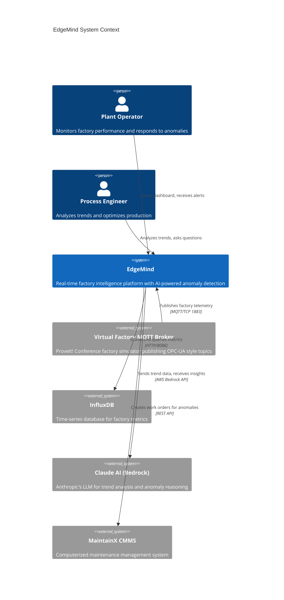
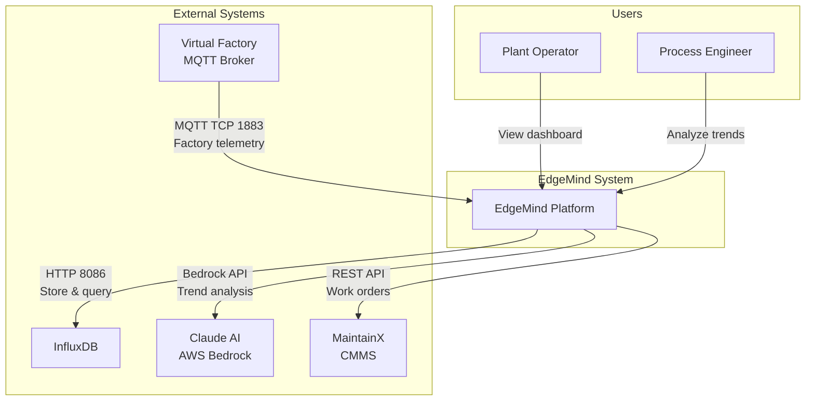

# C4 Level 1: System Context

This diagram shows EdgeMind within its operating environment, including all external systems and actors.

## System Context Diagram

## Simplified View (GitHub Compatible)

## External System Details

### Virtual Factory MQTT Broker

- **Host:** `virtualfactory.proveit.services:1883`
- **Protocol:** MQTT over TCP (no TLS)
- **Topics:** ISA-95 hierarchy with 3 enterprises, multiple sites
- **Message Rate:** ~500+ messages/second across all topics

### InfluxDB

- **Version:** 2.7
- **Port:** 8086
- **Organization:** proveit
- **Bucket:** factory
- **Retention:** Default (infinite)

### Claude AI (AWS Bedrock)

- **Model:** Claude 3.5 Sonnet (claude-3-5-sonnet-20241022)
- **Region:** us-east-1
- **Purpose:** Trend analysis, anomaly reasoning, natural language queries

### MaintainX CMMS

- **Integration:** REST API
- **Purpose:** Create work orders for detected anomalies
- **Status:** Optional integration (configurable)

## Data Volumes

| Flow | Volume | Frequency |
|------|--------|-----------|
| MQTT Ingestion | ~500 msg/sec | Continuous |
| InfluxDB Writes | ~500 points/sec | Continuous |
| AI Analysis | 1 request | Every 30 seconds |
| WebSocket Broadcast | ~50 msg/sec | Throttled (1/10th) |
