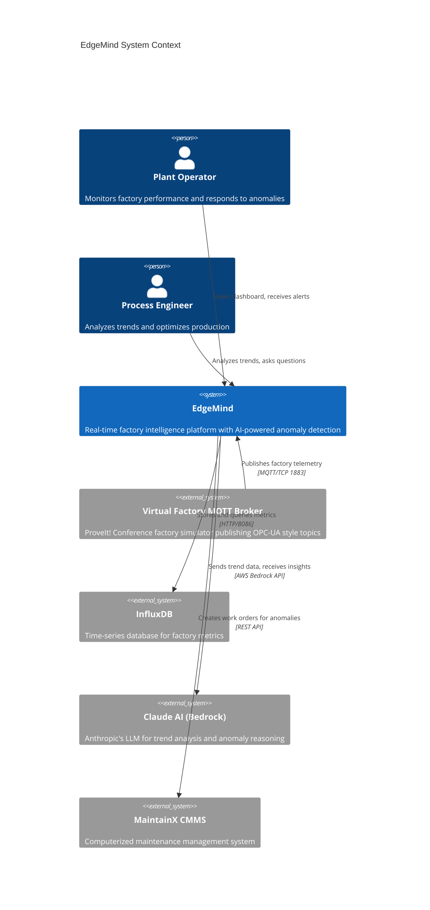

# C4 Level 1: System Context

This diagram shows EdgeMind within its operating environment, including all external systems and actors.

## System Context Diagram



## Simplified View (GitHub Compatible)

```mermaid
flowchart TB
    subgraph Users
        OP[Plant Operator]
        ENG[Process Engineer]
    end

    subgraph EdgeMind System
        EM[EdgeMind Platform]
    end

    subgraph External Systems
        MQTT[Virtual Factory<br/>MQTT Broker]
        INFLUX[InfluxDB]
        CLAUDE[Claude AI<br/>AWS Bedrock<br/>Simple Loop]
        CMMS[MaintainX<br/>CMMS]
    end

    subgraph AgentCore
        ORCH[Orchestrator]
        SPEC[Specialist Agents<br/>OEE, Equipment,<br/>Waste, Batch]
        LAMBDA[Lambda Tools]
    end

    MQTT -->|MQTT TCP 1883<br/>Factory telemetry| EM
    EM -->|HTTP 8086<br/>Store & query| INFLUX
    EM -->|Bedrock API<br/>Trend analysis (30s)| CLAUDE
    EM -->|Bedrock Agents API<br/>On-demand questions| ORCH
    ORCH --> SPEC
    SPEC --> LAMBDA
    LAMBDA -->|Tool calls| EM
    EM -->|REST API<br/>Work orders| CMMS
    OP -->|View dashboard| EM
    ENG -->|Ask Agent questions| EM
```

## External System Details

### Virtual Factory MQTT Broker

- **Host:** `virtualfactory.proveit.services:1883`
- **Protocol:** MQTT over TCP (no TLS)
- **Topics:** ISA-95 hierarchy with 3 enterprises, multiple sites
- **Message Rate:** ~500+ messages/second across all topics

### InfluxDB

- **Version:** 2.7
- **Port:** 8086
- **Organization:** proveit
- **Bucket:** factory
- **Retention:** Default (infinite)

### Claude AI (AWS Bedrock) - Simple Loop

- **Model:** Claude Sonnet 4 (us.anthropic.claude-sonnet-4-20250514-v1:0)
- **Region:** us-east-1
- **Purpose:** Continuous trend analysis (30-second cycle), anomaly detection
- **Trigger:** Automatic (timer-based)

### AgentCore (AWS Bedrock Agents) - Multi-Agent System

- **Service:** AWS Bedrock Agents
- **Mode:** Supervisor (multi-agent collaboration)
- **Region:** us-east-1
- **Purpose:** On-demand deep analysis, complex question answering

**Agent Components:**

| Agent | ID | Domain |
|-------|-----|--------|
| Orchestrator | `edgemind-orchestrator` | Routes questions to specialists |
| OEE Analyst | `edgemind-oee-analyst` | OEE analysis (Enterprise A/B) |
| Equipment Health | `edgemind-equipment-health` | Equipment state monitoring |
| Waste Analyst | `edgemind-waste-analyst` | Defect/quality analysis |
| Batch Process | `edgemind-batch-process` | ISA-88 batch metrics (Enterprise C) |

**Lambda Action Groups:**
- Single Lambda routes tool calls to backend API
- Tools: `get_oee_breakdown`, `get_equipment_states`, `get_waste_by_line`, `get_batch_health`, `query_influxdb`

### MaintainX CMMS

- **Integration:** REST API
- **Purpose:** Create work orders for detected anomalies
- **Status:** Optional integration (configurable)

## Data Volumes

| Flow | Volume | Frequency |
|------|--------|-----------|
| MQTT Ingestion | ~500 msg/sec | Continuous |
| InfluxDB Writes | ~500 points/sec | Continuous |
| Simple Loop AI | 1 request | Every 30 seconds |
| AgentCore (on-demand) | 1-5 requests | Per user question |
| WebSocket Broadcast | ~50 msg/sec | Throttled (1/10th) |

## Dual AI Architecture

EdgeMind uses two complementary AI systems:

| System | Purpose | Trigger | Latency |
|--------|---------|---------|---------|
| **Simple Loop** | Continuous monitoring, real-time alerts | Automatic (30s) | 2-5s |
| **AgentCore** | Deep analysis, complex questions | User-initiated | 10-30s |

This dual architecture provides both continuous situational awareness AND the ability to answer complex, multi-step questions when needed.
