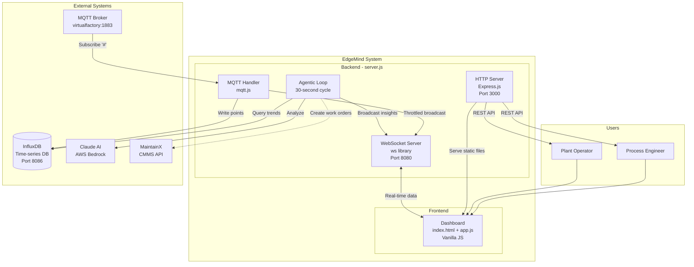

# C4 Level 2: Container Diagram

This diagram shows the major runtime containers that make up the EdgeMind system.

## Container Diagram



## Container Descriptions

### Backend (server.js)

Single Node.js process handling all backend responsibilities:

| Component | Technology | Responsibility |
|-----------|------------|----------------|
| HTTP Server | Express.js | Serve static files, REST API endpoints |
| WebSocket Server | ws library | Real-time bidirectional communication |
| MQTT Handler | mqtt.js | Subscribe to all topics, parse messages |
| Agentic Loop | setInterval | Periodic AI analysis cycle |

**Ports:**
- HTTP: 3000
- WebSocket: 8080 (separate port)

### Frontend (Dashboard)

Static web application served by the backend:

| File | Lines | Purpose |
|------|-------|---------|
| index.html | ~300 | HTML structure, layout |
| styles.css | ~1800 | All CSS styling |
| app.js | ~1500 | WebSocket client, UI logic, charts |

**Features:**
- Real-time metric display
- Enterprise/site hierarchy navigation
- AI insight panel
- OEE gauges and trend charts

### InfluxDB

Time-series database optimized for factory telemetry:

- **Data Model:** Measurement per metric type, tagged by hierarchy
- **Query Language:** Flux
- **Retention:** Configurable (default: infinite)
- **Aggregation:** 1-minute windows for AI analysis

### Claude AI (Bedrock)

AI service for trend analysis:

- **Input:** 5-minute rolling window of aggregated metrics
- **Output:** Structured JSON with insights, anomalies, recommendations
- **Memory:** Maintains session context for follow-up questions

## Port Mapping

```
+-------------------+
|     Container     |
+-------------------+
| HTTP  :3000  <----|----- Browser requests (REST API, static files)
| WS    :8080  <----|----- Browser WebSocket connection
| MQTT  :1883  -----|----- Outbound to broker (subscriber)
| Influx:8086  -----|----- Outbound to InfluxDB
+-------------------+
```

## Deployment Architecture


**Production (EC2):**
- Container: `edgemind-backend`
- Bind mounts: server.js, index.html (hot reload)
- Manual copy: lib/, styles.css, app.js

**Development (Local):**
- `npm run dev` with nodemon for auto-reload
- Same ports, same configuration
