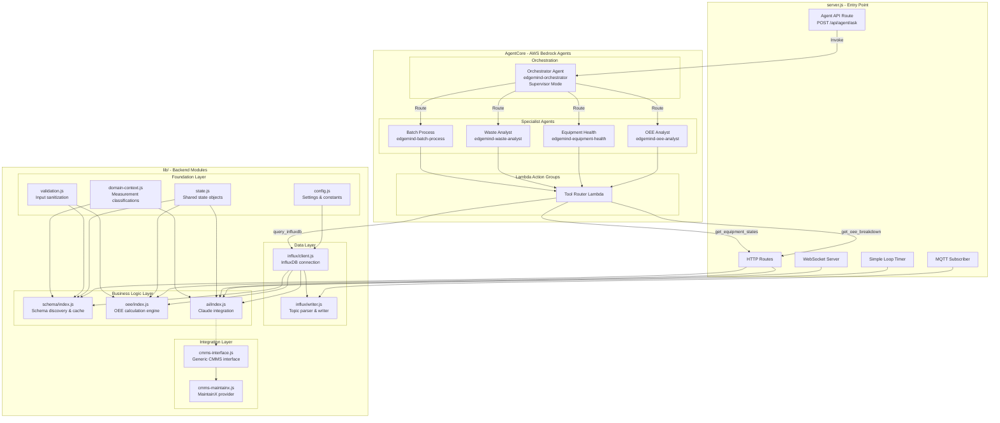
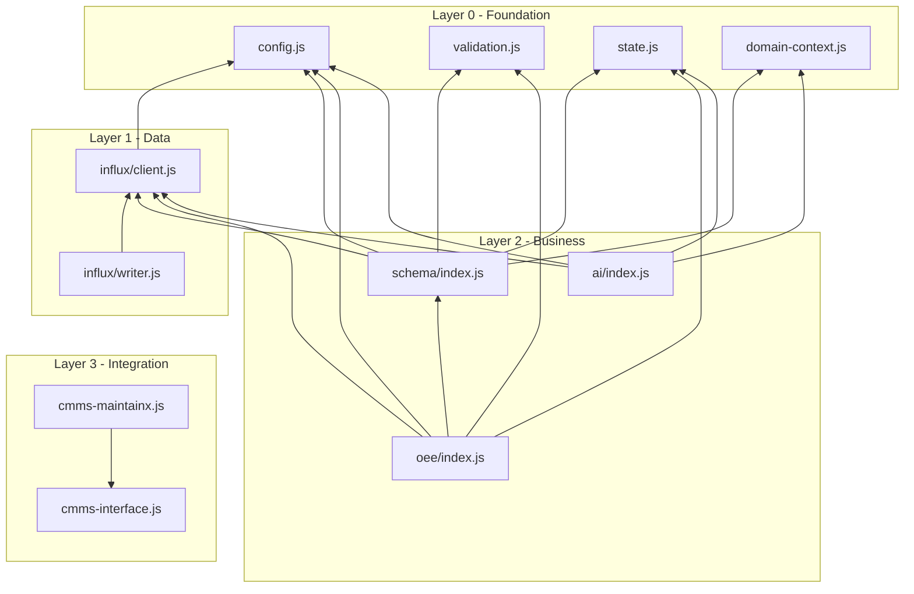
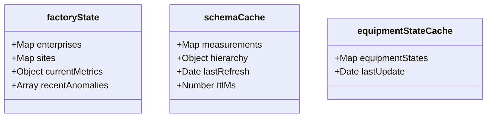

# C4 Level 3: Component Diagram

This diagram shows the internal structure of the backend, focusing on the modular lib/ architecture and the AgentCore multi-agent system.

## Component Overview



## Module Dependency Graph



## Module Details

### Foundation Layer (No Dependencies)

| Module | Purpose | Key Exports |
|--------|---------|-------------|
| `config.js` | Centralized configuration | `INFLUX_*`, `MQTT_*`, `AI_*` constants |
| `validation.js` | Input sanitization | `sanitizeString()`, `validateEnterprise()` |
| `state.js` | Shared state containers | `factoryState`, `schemaCache`, `equipmentStateCache` |
| `domain-context.js` | Domain knowledge | `MEASUREMENT_CLASSIFICATIONS`, context for AI |

### Data Layer

| Module | Purpose | Dependencies |
|--------|---------|--------------|
| `influx/client.js` | InfluxDB connection setup | config |
| `influx/writer.js` | MQTT topic to InfluxDB point | influx/client |
| `mqtt/topic-classifier.js` | Pattern-based topic parsing | None |

**Topic Classifier (`lib/mqtt/topic-classifier.js`):**

Pattern-based MQTT topic parsing that replaces positional parsing with explicit pattern matching:

```javascript
// Pattern structure
{
  name: 'enterprise_b_state_type',
  match: /^(Enterprise B)\/([^/]+)\/([^/]+)\/([^/]+)\/([^/]+)\/processdata\/state\/type$/,
  type: 'equipment_state',
  stateMap: { 'Running': 'running', 'Idle': 'idle', ... },
  extract: (m) => ({ enterprise: m[1], site: m[2], ... })
}
```

**Classification Types:**
- `equipment_state` - Machine state (running/idle/down)
- `state_metadata` - State duration, reason codes
- `oee_metric` - OEE components (availability, performance, quality)
- `process_metric` - Temperature, pressure, speed, etc.
- `batch_metric` - ISA-88 batch process data (Enterprise C)

**Topic Parsing Logic:**
```
Input:  "Enterprise A/Dallas Line 1/packaging/box01/motor/temperature/actual"
Output: Measurement: "temperature_actual"
        Tags: { enterprise: "Enterprise A", site: "Dallas Line 1",
                area: "packaging", machine: "box01" }
        Field: value (float)
```

### Business Logic Layer

| Module | Purpose | Dependencies |
|--------|---------|--------------|
| `schema/index.js` | Dynamic schema discovery | influx/client, state, config, validation, domain-context |
| `oee/index.js` | Tier-based OEE calculation | influx/client, state, schema, config, validation |
| `ai/index.js` | Claude AI integration | influx/client, state, config, domain-context |

**OEE Tier Strategy:**
```
Tier 1: Direct OEE metric available
Tier 2: Availability + Performance + Quality components
Tier 3: Availability + Performance only
Tier 4: Availability only (degraded)
```

### Integration Layer

| Module | Purpose | Dependencies |
|--------|---------|--------------|
| `cmms-interface.js` | Generic CMMS abstraction | None |
| `cmms-maintainx.js` | MaintainX implementation | cmms-interface |

## State Objects



## API Routes to Module Mapping

| Endpoint | Module | Function |
|----------|--------|----------|
| `GET /api/schema/measurements` | schema/index.js | `refreshSchemaCache()` |
| `GET /api/schema/hierarchy` | schema/index.js | `refreshHierarchyCache()` |
| `GET /api/trends` | ai/index.js | Direct InfluxDB query |
| `GET /api/oee/v2` | oee/index.js | `calculateOEE()` |
| `GET /api/oee/discovery` | oee/index.js | `discoverOEESchema()` |
| `GET /api/factory/status` | oee/index.js | `getFactoryStatus()` |
| `POST /api/agent/ask` | server.js | AgentCore proxy (invokes Bedrock Agent) |

## AgentCore Component Details

### Agent Architecture

Three specialized agents deployed via AWS Bedrock AgentCore:

```
agent/
├── anomaly/           # Continuous trend analysis
│   ├── src/main.py
│   ├── src/prompt.yaml
│   └── src/model/load.py
├── chat/              # Interactive Q&A
│   ├── src/main.py
│   ├── src/prompt.yaml
│   ├── src/model/load.py
│   └── src/tools/     # Knowledge base tools
└── troubleshoot/      # Equipment diagnostics
    ├── src/main.py
    ├── src/prompt.yaml
    ├── src/model/load.py
    └── src/tools/     # Knowledge base tools
```

### Agent Responsibilities

| Agent | Trigger | Purpose | Tools |
|-------|---------|---------|-------|
| **Anomaly** | Scheduled (30s) | Trend analysis, threshold monitoring, waste alerts | InfluxDB queries |
| **Chat** | On-demand | Interactive Q&A, OEE analysis, equipment status | Knowledge base, API queries |
| **Troubleshoot** | On-demand | Equipment diagnostics, SOP lookup, guided resolution | Knowledge base, API queries |

### Agent Flow

```
User: "Why is OEE dropping in Enterprise A?"
  |
  v
Agent API: Routes to Chat Agent
  |
  v
Chat Agent: Queries OEE data via tools
  |
  v
Response: Returns analysis with specific metrics
```

### Knowledge Base Tools (Chat & Troubleshoot)

```python
# tools/local_kb.py - Knowledge base search
def search_knowledge_base(query: str) -> list:
    """Search SOPs and documentation for relevant content."""
    # Returns matching documents with citations
```

**Available Tools:**

| Tool | Description | Used By |
|------|-------------|---------|
| `search_knowledge_base` | Search SOPs and documentation | Chat, Troubleshoot |
| `get_equipment_status` | Current equipment states | Chat, Troubleshoot |
| `query_metrics` | InfluxDB metric queries | All agents |
