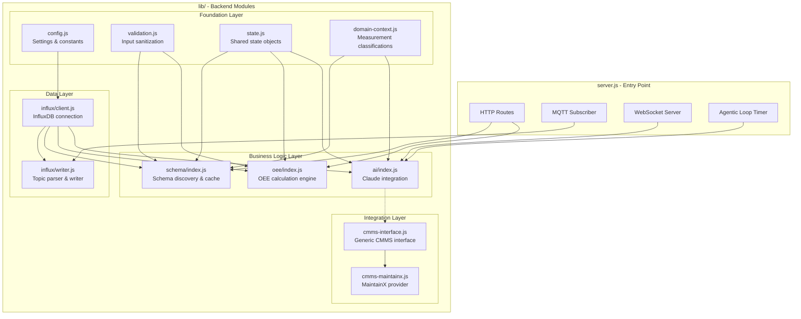

# C4 Level 3: Component Diagram

This diagram shows the internal structure of the backend, focusing on the modular lib/ architecture.

## Component Overview



## Module Dependency Graph


## Module Details

### Foundation Layer (No Dependencies)

| Module | Purpose | Key Exports |
|--------|---------|-------------|
| `config.js` | Centralized configuration | `INFLUX_*`, `MQTT_*`, `AI_*` constants |
| `validation.js` | Input sanitization | `sanitizeString()`, `validateEnterprise()` |
| `state.js` | Shared state containers | `factoryState`, `schemaCache`, `equipmentStateCache` |
| `domain-context.js` | Domain knowledge | `MEASUREMENT_CLASSIFICATIONS`, context for AI |

### Data Layer

| Module | Purpose | Dependencies |
|--------|---------|--------------|
| `influx/client.js` | InfluxDB connection setup | config |
| `influx/writer.js` | MQTT topic to InfluxDB point | influx/client |

**Topic Parsing Logic:**
```
Input:  "Enterprise A/Dallas Line 1/packaging/box01/motor/temperature/actual"
Output: Measurement: "temperature_actual"
        Tags: { enterprise: "Enterprise A", site: "Dallas Line 1",
                area: "packaging", machine: "box01" }
        Field: value (float)
```

### Business Logic Layer

| Module | Purpose | Dependencies |
|--------|---------|--------------|
| `schema/index.js` | Dynamic schema discovery | influx/client, state, config, validation, domain-context |
| `oee/index.js` | Tier-based OEE calculation | influx/client, state, schema, config, validation |
| `ai/index.js` | Claude AI integration | influx/client, state, config, domain-context |

**OEE Tier Strategy:**
```
Tier 1: Direct OEE metric available
Tier 2: Availability + Performance + Quality components
Tier 3: Availability + Performance only
Tier 4: Availability only (degraded)
```

### Integration Layer

| Module | Purpose | Dependencies |
|--------|---------|--------------|
| `cmms-interface.js` | Generic CMMS abstraction | None |
| `cmms-maintainx.js` | MaintainX implementation | cmms-interface |

## State Objects


## API Routes to Module Mapping

| Endpoint | Module | Function |
|----------|--------|----------|
| `GET /api/schema/measurements` | schema/index.js | `refreshSchemaCache()` |
| `GET /api/schema/hierarchy` | schema/index.js | `refreshHierarchyCache()` |
| `GET /api/trends` | ai/index.js | Direct InfluxDB query |
| `GET /api/oee/v2` | oee/index.js | `calculateOEE()` |
| `GET /api/oee/discovery` | oee/index.js | `discoverOEESchema()` |
| `GET /api/factory/status` | oee/index.js | `getFactoryStatus()` |
