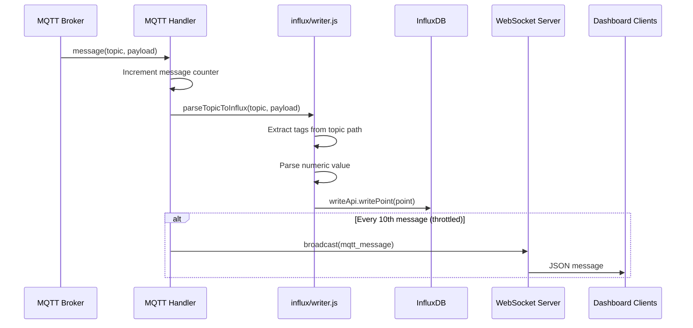
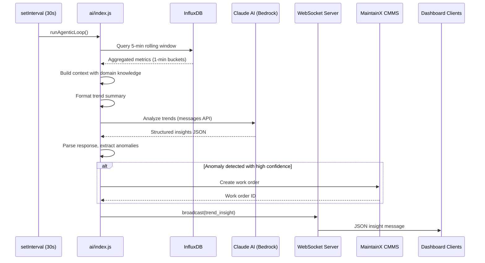
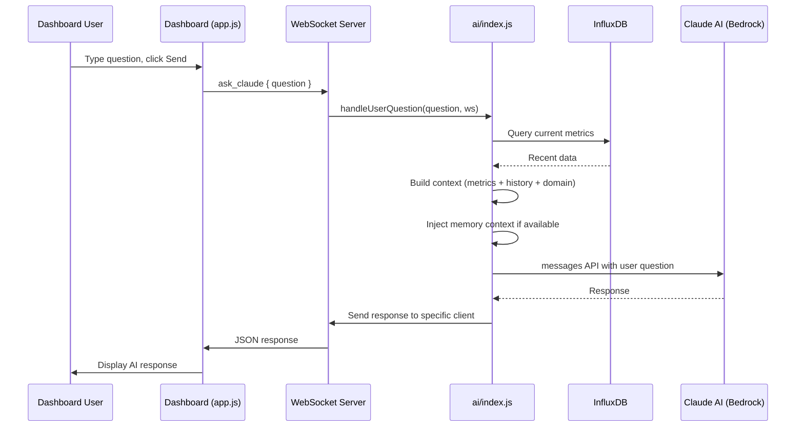
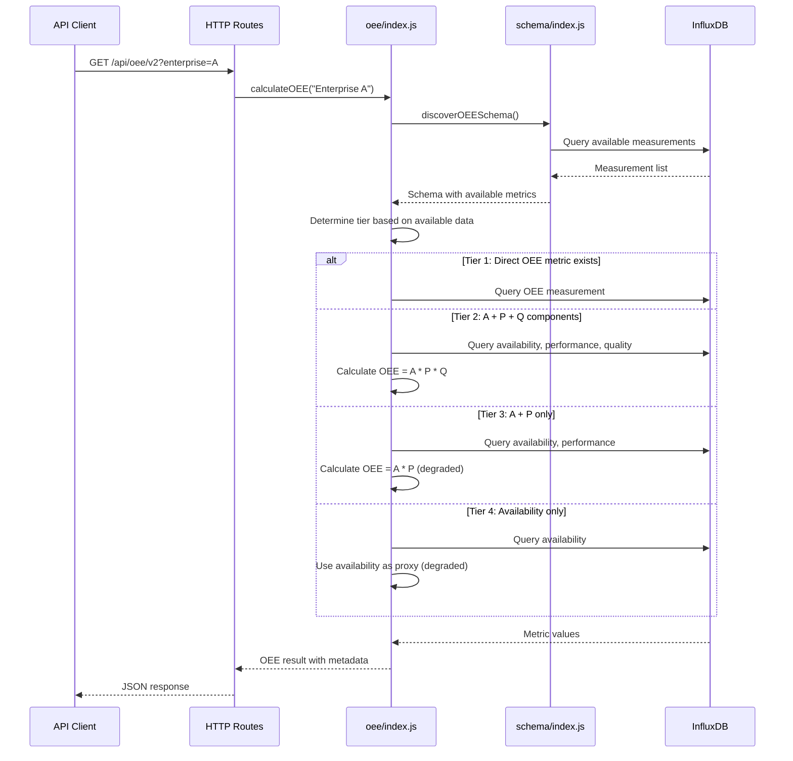
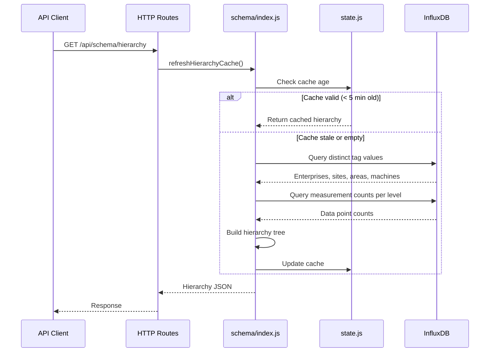
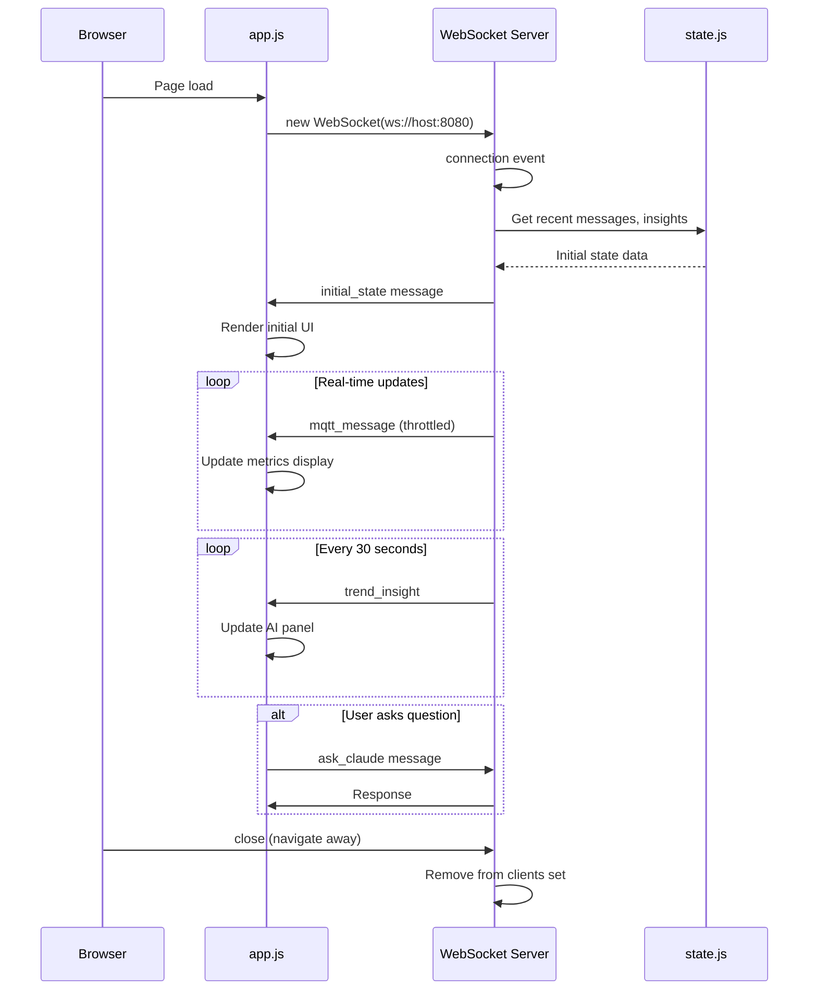

# Data Flow Diagrams

This document contains sequence diagrams for the key data flows in EdgeMind.

## 1. MQTT Ingestion Flow

Data flows from the virtual factory MQTT broker into InfluxDB storage.



**Key Points:**
- Subscribes to `#` (all topics)
- Parses ISA-95 hierarchy from topic path
- Writes every message to InfluxDB
- Throttles WebSocket broadcast to every 10th message

## 2. Agentic Loop (AI Analysis Cycle)

Every 30 seconds, the server analyzes recent trends and broadcasts insights.



**Timing:**
- Loop interval: 30 seconds
- Query window: 5 minutes
- Aggregation: 1-minute buckets

## 3. User Question Flow

When a user asks Claude a question through the dashboard.



## 4. OEE Calculation Flow

OEE queries use a tier-based strategy to adapt to available data.



**Response includes:**
- OEE value (0-100)
- Tier used
- Confidence level
- Measurements used
- Calculation method

## 5. Schema Discovery Flow

Dynamic schema discovery builds a cache of all measurements and hierarchy.



## 6. WebSocket Connection Lifecycle



## Data Flow Summary

```
                    +-----------------+
                    |  MQTT Broker    |
                    | (500+ msg/sec)  |
                    +--------+--------+
                             |
                             v
+------------------------------------------------------------------+
|                        server.js                                  |
|  +-------------+    +-------------+    +------------------+       |
|  | MQTT Handler|--->| Writer      |--->| InfluxDB         |       |
|  | (subscribe) |    | (parse)     |    | (store)          |       |
|  +-------------+    +-------------+    +--------+---------+       |
|        |                                        |                 |
|        | (1/10)                                 | (every 30s)     |
|        v                                        v                 |
|  +-------------+    +-------------+    +------------------+       |
|  | WebSocket   |<---| AI Module   |<---| Query            |       |
|  | Broadcast   |    | (analyze)   |    | (5-min window)   |       |
|  +------+------+    +------+------+    +------------------+       |
|         |                  |                                      |
+---------+------------------+--------------------------------------+
          |                  |
          v                  v
    +----------+      +-------------+
    | Dashboard |      | Claude AI   |
    | (browser) |      | (Bedrock)   |
    +----------+      +-------------+
```
