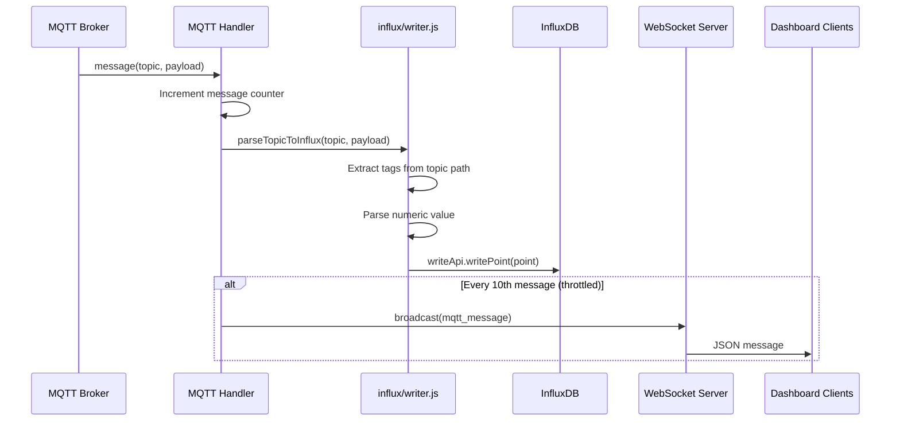
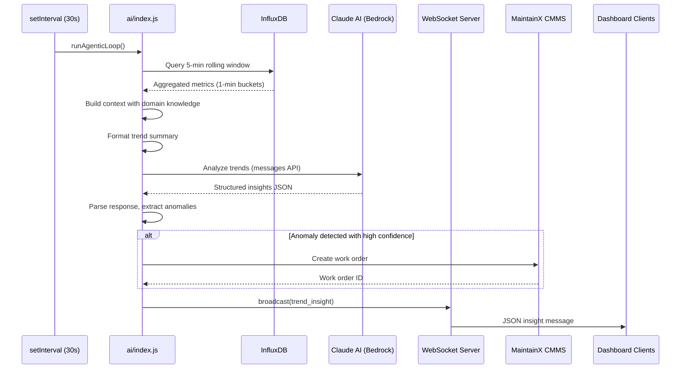
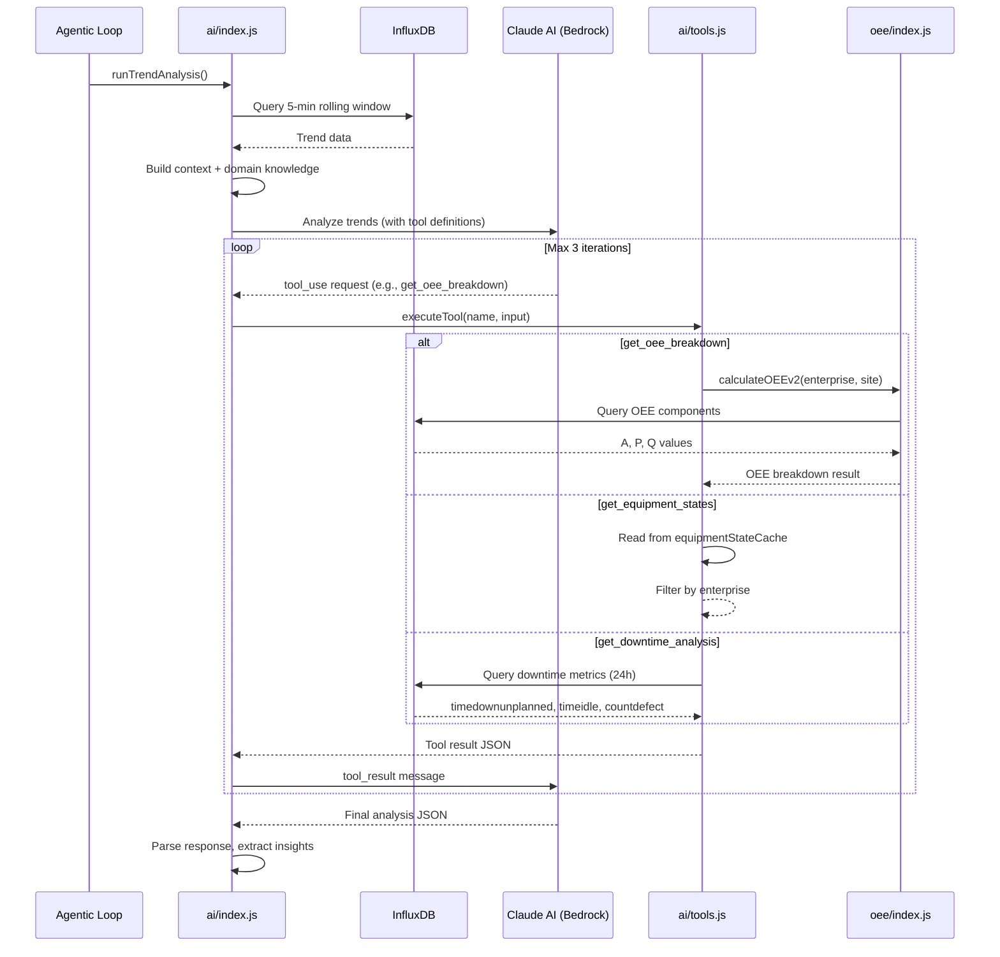
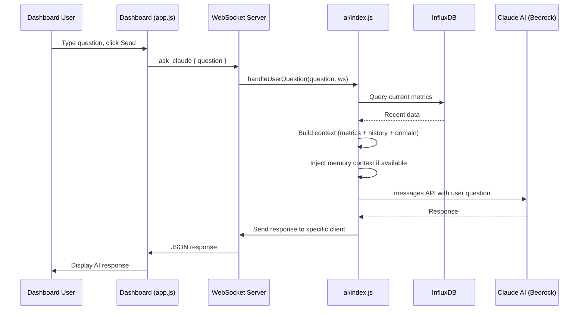
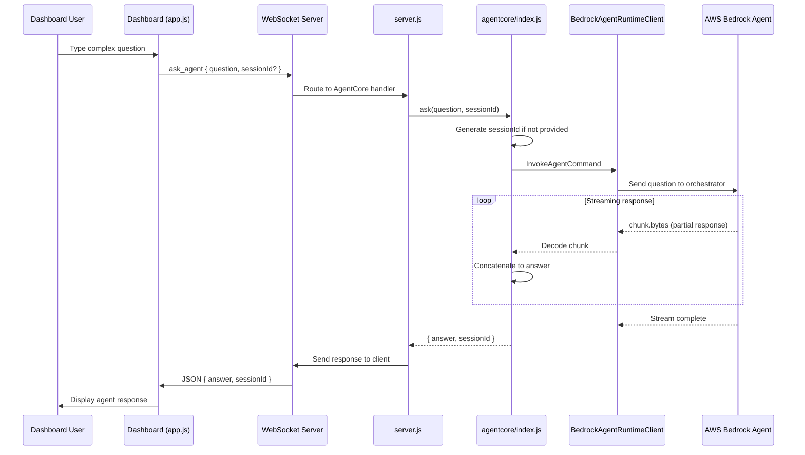
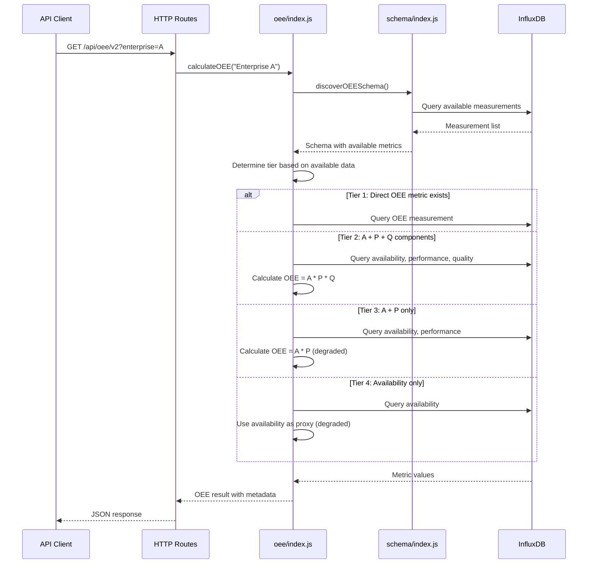
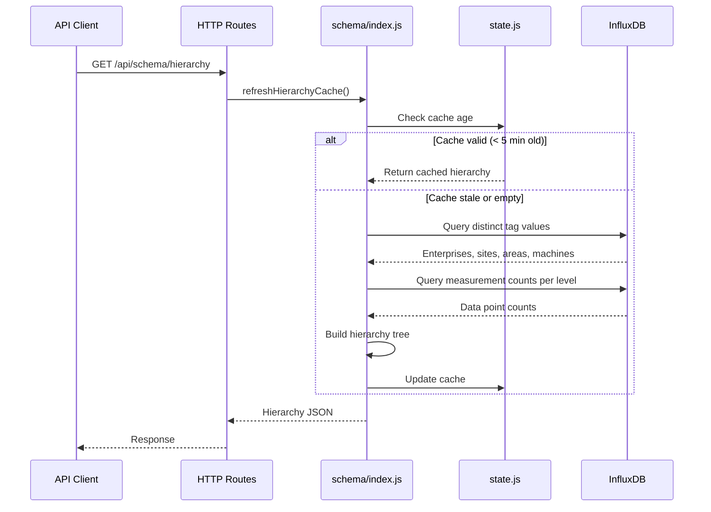
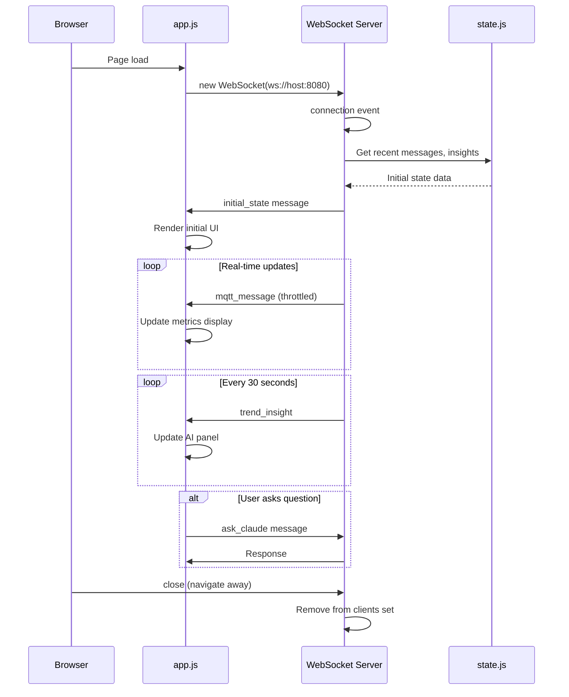

# Data Flow Diagrams

> **Sequence Diagrams** - Shows how data moves through EdgeMind over time.

While C4 diagrams show static structure, these sequence diagrams show dynamic behavior. Each diagram illustrates a specific operation from start to finish, showing which components are involved and in what order. Use these to understand runtime behavior and debug issues.

## 1. MQTT Ingestion Flow

Data flows from the virtual factory MQTT broker into InfluxDB storage.



**Key Points:**
- Subscribes to `#` (all topics)
- Parses ISA-95 hierarchy from topic path
- Writes every message to InfluxDB
- Throttles WebSocket broadcast to every 10th message

## 2. Agentic Loop (AI Analysis Cycle)

Every 30 seconds, the server analyzes recent trends and broadcasts insights.



**Timing:**
- Loop interval: 30 seconds
- Query window: 5 minutes
- Aggregation: 1-minute buckets

## 3. Tool-Use Analysis Flow

When Claude detects concerning metrics, it can use tools to investigate root causes. This flow shows the iterative tool_use pattern in the agentic loop.



**Available Tools:**

| Tool | Purpose | Data Source |
|------|---------|-------------|
| `get_oee_breakdown` | Availability, Performance, Quality components | InfluxDB (OEE calculation) |
| `get_equipment_states` | Current DOWN/IDLE/RUNNING states | In-memory cache |
| `get_downtime_analysis` | 24h downtime and defect aggregates | InfluxDB |

**Constraints:**
- Maximum 3 tool calls per analysis (30-second budget)
- Each Bedrock API call has 12-second timeout
- Each InfluxDB query has 8-second timeout

## 4. User Question Flow

When a user asks Claude a question through the dashboard.



## 5. AgentCore Question Flow

When a user question is routed to AWS Bedrock Agents orchestrator for complex multi-turn queries.



**Key Characteristics:**
- Streaming response (chunked delivery)
- Session continuity via sessionId (UUID)
- 1000 character question limit
- Handles specific error types: ResourceNotFoundException, ThrottlingException, ValidationException

**Session Management:**
- New session: Random UUID generated if sessionId not provided
- Continued session: Pass sessionId from previous response for multi-turn conversations

## 6. OEE Calculation Flow

OEE queries use a tier-based strategy to adapt to available data.



**Response includes:**
- OEE value (0-100)
- Tier used
- Confidence level
- Measurements used
- Calculation method

## 7. Schema Discovery Flow

Dynamic schema discovery builds a cache of all measurements and hierarchy.



## 8. WebSocket Connection Lifecycle



## Data Flow Summary

```
                    +-----------------+
                    |  MQTT Broker    |
                    | (500+ msg/sec)  |
                    +--------+--------+
                             |
                             v
+------------------------------------------------------------------+
|                        server.js                                  |
|  +-------------+    +-------------+    +------------------+       |
|  | MQTT Handler|--->| Writer      |--->| InfluxDB         |       |
|  | (subscribe) |    | (parse)     |    | (store)          |       |
|  +-------------+    +-------------+    +--------+---------+       |
|        |                                        |                 |
|        | (1/10)                                 | (every 30s)     |
|        v                                        v                 |
|  +-------------+    +-------------+    +------------------+       |
|  | WebSocket   |<---| AI Module   |<---| Query            |       |
|  | Broadcast   |    | (analyze)   |    | (5-min window)   |       |
|  +------+------+    +------+------+    +------------------+       |
|         |                  |                                      |
+---------+------------------+--------------------------------------+
          |                  |
          v                  v
    +----------+      +-------------+
    | Dashboard |      | Claude AI   |
    | (browser) |      | (Bedrock)   |
    +----------+      +-------------+
```

## Tool-Use Summary

```
+------------------+
|  Agentic Loop    |
|  (every 30s)     |
+--------+---------+
         |
         v
+------------------+     +------------------+
| Build Context    |---->| Claude Bedrock   |
| (trends, domain) |     | (tool_use API)   |
+------------------+     +--------+---------+
                                  |
                    +-------------+-------------+
                    |             |             |
                    v             v             v
            +-----------+  +-----------+  +-----------+
            | get_oee   |  | get_equip |  | get_down  |
            | breakdown |  | states    |  | analysis  |
            +-----+-----+  +-----+-----+  +-----+-----+
                  |              |              |
                  v              v              v
            +-----------+  +-----------+  +-----------+
            | InfluxDB  |  | Memory    |  | InfluxDB  |
            | (OEE)     |  | Cache     |  | (24h)     |
            +-----------+  +-----------+  +-----------+
```

---

**Previous:** [[Component-Diagram]] - The internal module structure.

**Related:**
- [[System-Context]] - External systems and users
- [[Container-Diagram]] - Runtime architecture
