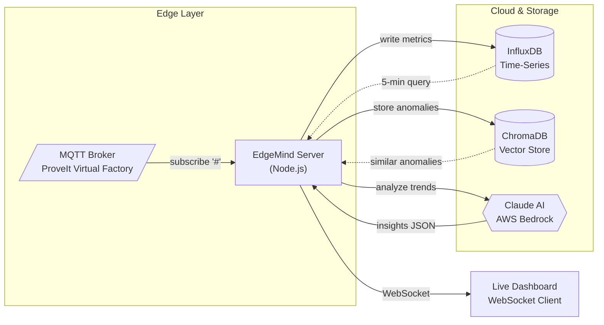

# EdgeMind

**Real-time factory intelligence dashboard with AI-powered anomaly detection**

EdgeMind connects to manufacturing MQTT brokers, stores time-series data in InfluxDB, and uses Claude AI on AWS Bedrock to automatically detect trends and anomalies. Built for the ProveIt! Conference 2026 virtual factory demonstration.

---

## Quick Navigation

| I want to... | Go to |
|--------------|-------|
| Get running in 5 minutes | [[Quick-Start]] |
| Understand the architecture | [[System-Context]] |
| Set up a dev environment | [[Development-Setup]] |
| Deploy to production | [[Fargate-Production]] |
| Learn about the AI analysis | [[AI-Trend-Analysis]] |
| Prepare for ProveIt! demo | [[Live-Demo-Guide]] |

---

## Architecture Overview



### Data Flow Summary

| Step | Component | Action |
|------|-----------|--------|
| 1 | MQTT Broker | Publishes sensor data from manufacturing equipment |
| 2 | EdgeMind Server | Subscribes to all topics, writes numeric data to InfluxDB |
| 3 | Agentic Loop | Every 30s: queries InfluxDB, summarizes trends |
| 4 | Claude AI | Analyzes trends, returns structured insights |
| 5 | Dashboard | Receives real-time data and AI insights via WebSocket |

---

## Key Features

**Real-Time Data Ingestion**
- Connects to MQTT brokers (Mosquitto-compatible)
- Handles high-throughput sensor data streams
- Automatic schema discovery from topic hierarchy

**AI-Powered Analysis**
- Claude on AWS Bedrock analyzes aggregated trends (not raw data)
- Structured JSON output: summary, trends, anomalies, recommendations
- 30-second analysis cycle balances real-time feel with API costs

**OEE Calculation**
- Tier-based strategy adapts to available measurements
- Supports enterprise and site-level breakdowns
- Discovery endpoint shows available OEE metrics

**Live Dashboard**
- WebSocket connection for instant updates
- Factory selector (Enterprise A, B, C)
- Interactive Claude Q&A with factory context

---

## Technology Stack

| Component | Technology |
|-----------|------------|
| Backend | Node.js + Express |
| Message Broker | MQTT (Mosquitto-compatible) |
| Time-Series DB | InfluxDB 2.7 |
| Vector DB | ChromaDB (anomaly persistence, RAG) |
| AI/ML | AWS Bedrock (Claude Sonnet) |
| AI Agents | AWS Bedrock Agents (AgentCore) |
| Real-Time | WebSocket |
| Frontend | HTML/CSS/JavaScript |

---

## Project Structure

```
EdgeMind/
├── server.js              # Backend entry point
├── index.html             # Live dashboard
├── css/                   # Modular stylesheets (23 files)
│   ├── variables.css      # CSS custom properties, persona themes
│   ├── base.css           # Reset, body, backgrounds
│   ├── layout.css         # Grid, persona-view system
│   └── ...                # 20 more component stylesheets
├── js/                    # Modular JavaScript (22 ES modules)
│   ├── app.js             # Entry point, imports all modules
│   ├── state.js           # Shared state objects
│   ├── websocket.js       # WebSocket connection
│   └── ...                # 19 more feature modules
├── lib/                   # Backend modules
│   ├── config.js          # Configuration
│   ├── validation.js      # Input validation
│   ├── state.js           # Shared state
│   ├── domain-context.js  # Domain knowledge
│   ├── influx/            # InfluxDB client and writer
│   ├── schema/            # Schema discovery
│   ├── oee/               # OEE calculation
│   ├── ai/                # Claude integration
│   │   ├── index.js       # Trend analysis, agentic loop
│   │   └── tools.js       # AI tool definitions
│   ├── agentcore/         # AWS Bedrock Agents integration
│   ├── vector/            # Vector storage (ChromaDB)
│   ├── sparkplug/         # Sparkplug B protocol decoder
│   ├── equipment/         # Equipment discovery and state
│   ├── demo/              # Demo scenarios and injection
│   ├── cmms-interface.js  # Generic CMMS interface
│   └── cmms-maintainx.js  # MaintainX CMMS provider
├── wiki/                  # Wiki documentation (source of truth)
└── docs/project_notes/    # Project memory (bugs, decisions, facts)
```

---

## Getting Started

Ready to run EdgeMind? Start with the [[Quick-Start]] guide.

For ProveIt! Conference preparation, see [[ProveIt-2026-Overview]].
